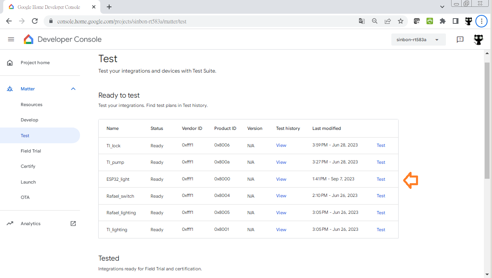

# ESP32_C6_matter_example_bin
ESP32 C6 matter lighting bin file. It is work with Google Nest Hub.  

After downloaded 1.4G esp-idf and 17G esp-matter, I done the bin file.  
Just for testing.  
You can flash these bin file with windows tools ( flash_download_tool_3.9.5_0.zip ) .  
0x0 build/bootloader/bootloader.bin   
0xc000 build/partition_table/partition-table.bin  
0x1d000 build/ota_data_initial.bin   
0x20000 build/light.bin  

Need to setting google developer console for google home and Google Nest Hub.  
Then you can control ESP32 C6 over voice.  
   

