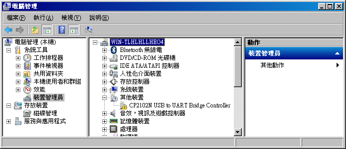
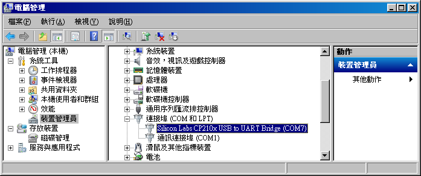
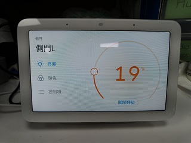
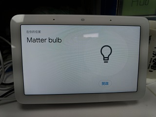
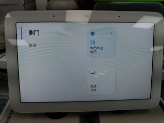
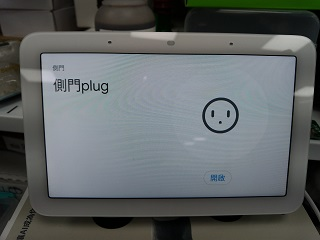
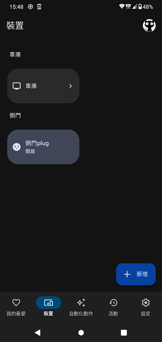
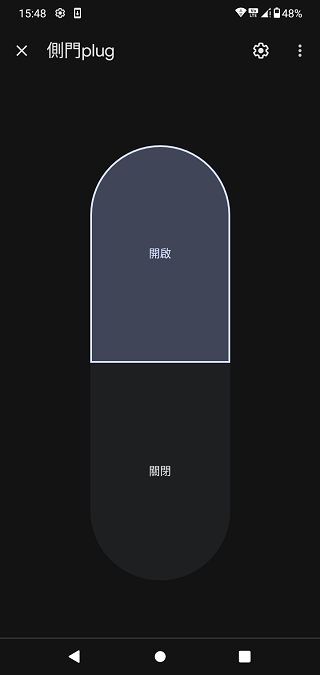

# ESP32_C6_C3_matter_example_bin
ESP32 C6 matter lighting bin file. It is work with Google Nest Hub.  

After downloaded 1.4G esp-idf and 17G esp-matter, I done the bin file.  
Just for testing.  
You can flash these bin file with windows tools ( flash_download_tool_3.9.5_0.zip ) .  
0x0 build/bootloader/bootloader.bin   
0xc000 build/partition_table/partition-table.bin  
0x1d000 build/ota_data_initial.bin   
0x20000 build/light.bin  
 
PIN is 34970112332  
 
 
 
The PID is set in sdkconfig / CONFIG_DEVICE_PRODUCT_ID  
Default, both VID/PID is 0xFFF1 and 0X8000  
 
Need to setting google developer console for google home and Google Nest Hub.  
Then you can control ESP32 C6 over voice.  
   
 
# plug c2 demo bin
gpio#1, blue light, as contorl for relay/SSR.  
gpio#18, as button to on/off plug, short to GND as press button.
 
# Others resource
matter device factoryreset  
 
 
 
 
 
 
 
color light  
 
 
 
dimmer light  
 
 
 
onoff light  
 
 
 
plug, end of google nest hub  
 
 
 
plug, end of google nest hub  
 
 
 
plug, end of phone  
 
 
 
plug, end of phone  
 
